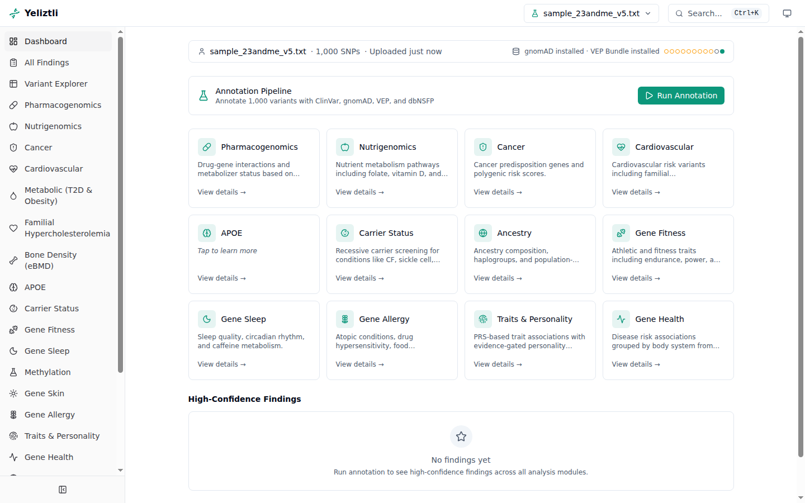

# Reading your results

Once annotation finishes, the **dashboard** is your home screen.

## The dashboard

- **Status bar** (top) — the current sample, annotation status, and reference-database
  versions.
- **Module cards** — a grid linking to each analysis module, with finding counts.
- **High-confidence findings** — the strongest findings across all modules.
- **QC summary** — a collapsible panel of sample-quality metrics (heterozygosity, call rate,
  per-chromosome counts).

Use the **sample selector** in the top navigation to switch between uploaded samples; each
has its own isolated results.

## Findings and evidence ratings

Every analysis module produces **findings**, and each finding carries an **evidence rating**
(★ to ★★★★) so you can tell well-established results from speculative ones at a glance:

| Rating | Roughly means |
|--------|---------------|
| ★★★★ | Strong clinical evidence — e.g. ClinVar Pathogenic/Likely-Pathogenic (reviewed), CPIC Level A, or genome-wide-significant GWAS. |
| ★★★ | Good evidence — e.g. Likely-Pathogenic (single submitter), CPIC Level B, or replicated GWAS. |
| ★★ | Moderate — e.g. a variant of uncertain significance with functional support, or a single large GWAS. |
| ★ | Weak/preliminary — e.g. a single study or candidate-gene association. |

The **[module reference](../modules/index.md)** explains what each module reports and how to
interpret it. Some modules (wellness/trait scores) are intentionally **capped** at lower
ratings, and some report **categorical levels** rather than numeric risk.

## The Findings Explorer

Beyond the per-module pages, the **Findings Explorer** lets you search and filter findings
across every module at once — by evidence rating, module, gene, or phenotype. Modules that do
not have their own dashboard page still surface their findings here.

## Sensitive results are opt-in

A few modules are **disclosure-gated**: their results stay hidden until you explicitly
acknowledge what you're about to see (for example *APOE* and Alzheimer's-risk-related
findings). You're always in control of when those are revealed.

!!! warning "Findings are a starting point, not a diagnosis"
    Treat every finding as **provisional**. Consumer array data produces false positives,
    especially for rare variants — see [Intended use & disclaimers](../intended-use.md).
    Confirm anything health-related with a clinician and an accredited lab.

## Going deeper

From here you can dig into individual variants in the
**[Variant Explorer](../features/variant-explorer.md)**, visualise them in the
**[Genome Browser](../features/genome-browser.md)**, build **[custom queries](../features/query-builder.md)**,
and generate **[PDF reports](../features/reports.md)**.
